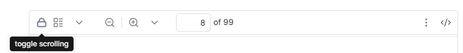

# PDF Scroll Lock

This plugin is useful when there is a pdf embedded in the notes (markdown files).

`![[mypdf.pdf#page=34]]` , this lets the embed pdf to show that particular page inside the notes.

Issue - There is no way to prevent the pdf from scrolling, made the bad experience as we are reading our notes with focus and unintentionally pdf gets scrolled.

**This plugin resolves this by locking the embed pdf from scrolling by default and provide the toggle button in the toolbar for turn on and off this plugin per embedded pdf**

### Installation steps

1. download the `main.js` and `manifest.json` from this repository
2. put these files inside your `<path to your vault>/.obsidian/plugins/` folder
3. open the command palette by pressing `ctrl + p` and run command `Reload app without saving`
4. go in `Community Plugins` inside settings and toggle the plugin (make sure restricted mode is off)